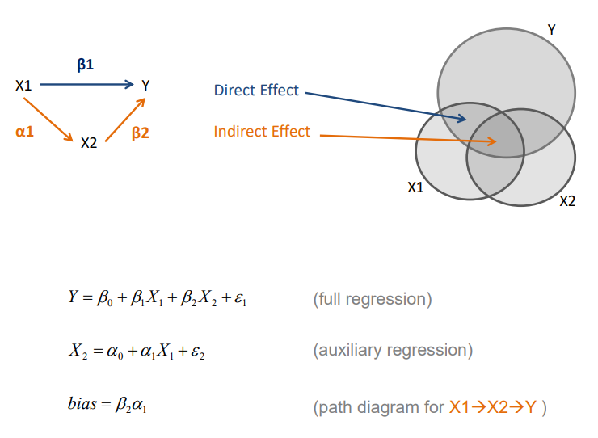

```{r setup, include=FALSE}
# do not change this chunk
knitr::opts_chunk$set(echo=F, fig.width=6, fig.height=4, warning=F, message=F )
```


**CPP 523**


```{r, echo=F}
# do not change this chunk

# load data
URL <- "https://raw.githubusercontent.com/DS4PS/cpp-523-fall-2019/master/labs/class-size-seed-1234.csv"
dat <- read.csv( URL )

# load draw_ci function
source( "https://raw.githubusercontent.com/DS4PS/sourcer-r/master/sourcer.R" )
```


## Class Size Data From Lab 02

<br>


```{r, results='asis', echo=F}
# do not change this code 

library( stargazer )

m1 <- lm( test ~ csize, data=dat  ) 
m2 <- lm( test ~ csize + tqual, data=dat )
m3 <- lm( test ~ tqual + ses, data=dat ) 
m4 <- lm( test ~ csize + ses, data=dat  )
m5 <- lm( test ~ csize + tqual + ses, data=dat  )

m.auxiliary <- lm( ses ~ csize, data=dat )

stargazer( m1, m2, m3, m4, m5, 
           type = "html", digits=2,
           dep.var.caption = "Dependent Variable: Test Scores",
           # dep.var.labels = "",
           dep.var.labels.include = FALSE,
           omit.stat = c("rsq", "f", "ser"),
           column.labels = c("Model 1", "Model 2", "Model 3", "Model 4", "Model 5"),
           covariate.labels=c("Classroom Size",
                              "Teacher Quality",
                              "Socio-Economic Status",
                              "Intercept"),
           notes.label = "Standard errors in parentheses")


```

<br>

[Lecture Notes](https://github.com/DS4PS/cpp-523-spr-2020/raw/master/lectures/p-07-omitted-variable-bias.pdf) 




## Tables and Math


Consider the effect of omitting SES from the full model of CS + SES: 

EQUATION | MODEL  
---------|--------------------------
| $TestScore = B_0 + B_1 \cdot ClassSize + B_2 \cdot SES + e_1$ | $(Full \ Model)$ |
| $TestScore = b_0 + b_1 \cdot ClassSize + e_2$  |   $(Naive \ Model)$ |
| $SES = a_0 + a_1 \cdot ClassSize + e_3$  |  $(Auxiliary \  Regression)$ | 


```{r, eval=T, echo=F, results='asis'}

stargazer( m4, m1, m.auxiliary, 
           type = "html", digits=3,
           dep.var.caption = "Dependent Variables",
           # dep.var.labels = "Dependent Variables",
           dep.var.labels.include = FALSE,
           omit.stat = c("rsq", "f", "ser"),
           column.labels = c("TS", "TS", "SES"),
           covariate.labels=c("Classroom Size",
                              "Socio-Economic Status",
                              "Intercept"),
           notes.label = "Standard errors in parentheses")
```


<iframe width="800" height=500 src="https://www.youtube.com/embed/U3rOm-yBUzY" frameborder="0" allow="accelerometer; autoplay; encrypted-media; gyroscope; picture-in-picture" allowfullscreen></iframe>

<br>


## Code for the Example


[PDF](https://github.com/DS4PS/cpp-523-spr-2020/raw/master/lectures/omitted-variable-bias-example.pdf)


```{r, echo=T, eval=F}

URL <- "https://raw.githubusercontent.com/DS4PS/cpp-523-fall-2019/master/labs/class-size-seed-1234.csv"
dat <- read.csv( URL )

m1 <- lm( test ~ csize, data=dat  ) 
m2 <- lm( test ~ csize + tqual, data=dat )
m3 <- lm( test ~ tqual + ses, data=dat ) 
m4 <- lm( test ~ csize + ses, data=dat  )
m5 <- lm( test ~ csize + tqual + ses, data=dat  )


# FULL MODEL
summary( m4 )
# lm(formula = test ~ csize + ses, data = dat)
# Coefficients:
# ----------------------------------
#             Estimate Std. Error t value Pr(>|t|)    
# (Intercept)  665.289     76.574   8.688   <2e-16 ***
# csize         -2.671      1.632  -1.637    0.102    
# ses           16.344     17.098   0.956    0.339    
# ----------------------------------

# NAIVE MODEL 
summary( m1 )

# lm(formula = test ~ csize, data = dat)
# Coefficients:
# ----------------------------------
#             Estimate Std. Error t value Pr(>|t|)    
# (Intercept) 738.3366     4.8788  151.34   <2e-16 ***
# csize        -4.2221     0.1761  -23.98   <2e-16 ***
# ----------------------------------


# AUXILIARY REGRESSION
m.auxiliary <- lm( ses ~ csize, data=dat )
summary( m.auxiliary )

# lm(formula = ses ~ csize, data = dat)
# Coefficients:
# ----------------------------------
#              Estimate Std. Error t value Pr(>|t|)    
# (Intercept)  4.469458   0.009033   494.8   <2e-16 ***
# csize       -0.094876   0.000326  -291.0   <2e-16 ***
# ----------------------------------


# b1 = B1 + bias
# b1 - B1 = bias
b1 <- -4.22
B1 <- -2.67
b1 - B1

# bias = a1*B2
a1 <- -0.0949
B2 <- 16.34
a1*B2

```


<br>
<br>

---

<br>
<br>


