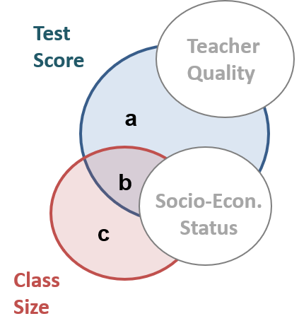
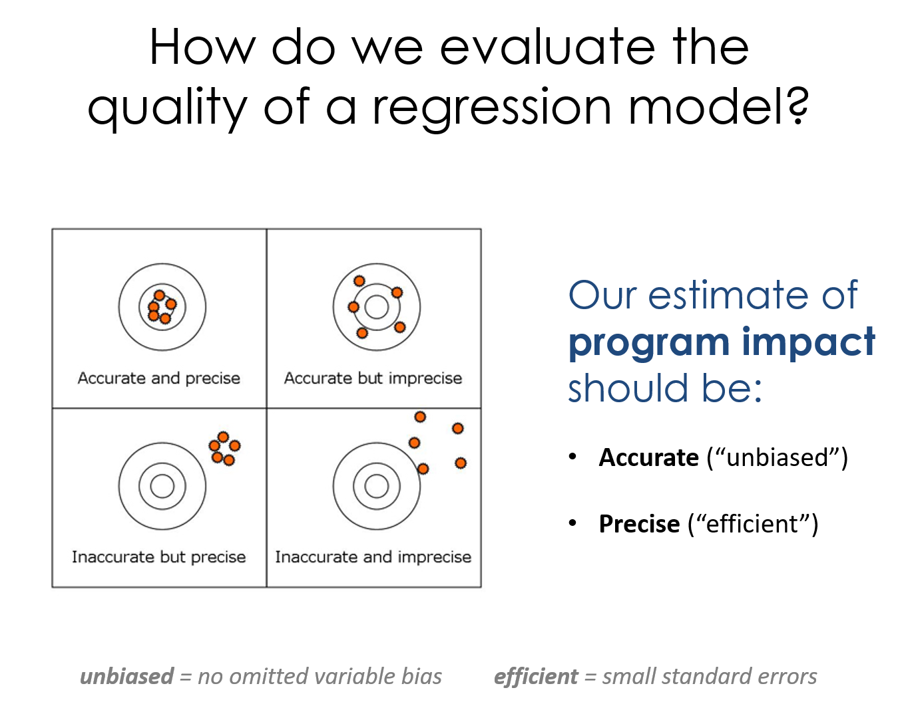

<!--- 
Submit Button - <a class="uk-button uk-button-primary" href="{{page.canvas.assignment_url}}">SUBMIT LAB</a>
-->


<div class = "uk-container uk-container-small">
  
<br><br>
<br><br>

**COURSE CONTENT:**

-----------------------

* TOC
{:toc}

-----------------------

<br>


# Semester Overview 


These courses are designed to be interactive, and a lot of learning occurs by practicing the technical jargon from the field and learning how to talk about data and models. 


<br>

## Course Cadence 

Please note the organizatin of assignments for class. 


<br>

**Labs are due Saturday**, mini assessments covering the previous lab are on Tuesday. 

Get started early on labs so you have time to ask questions on the discussion board if you get stuck. 

Labs are graded pass-fail. The criteria is that you demonstrate an understanding of the topics covered, which is typically operationalized as getting over half of the questions on the assignment correct. 

The mini assessments typically consist of three multiple-choice or matching questions to guage your understanding of the previous week's lectures and lab. If you understood everything on the labs you should do fine on the mini assessments. 

**Mini-assessments open on Saturday and close Tuesday at 11:59pm (AZ time).** You have 30 minutes to complete an assessment once they start. You can take it at any time Sat-Tues.


<br>

## Tips for Success

**There is no way to learn and retain all of this material in one course.** 

It is completely normal for this material to not click the first time you see it. We will try to repeat concepts and build on them through the semester, and the Evaluation sequence in this program (CPP 523, 524, and 525) offer reinforcement. 

You are investing in a skill-set that you will build over time. You will find some material organized for quick reference on the [Resources](../resources/) page. 

You are encouraged to build your own library of sources you find useful and keep them for future reference. 


<br>

## Getting Help

Learning how to seek help and use discussion boards will accelerate learning and facilitate collaboration. Social coding tools like GitHub use these features extensively. 

We are going to throw a lot at you, but also provide a lot of support. Over these first couple of weeks feel free to reach out for anything you might need. 

If you find something confusing let us know (likely others will find it confusing as well). 

* You can post a question to the homework [discussion board](../help/).  
* You can schedule a Zoom call to do a screen share if you want to walk through anything. 
* Or you can request a walk-through of a problem. The instructor will provide an example with the solution. 

As a general rule of thumb, if you are stuck on the math or code for a problem, need clarification about what the question is asking, want to make sure you understand a formula, or are having similar issues then the help discussion page is the easiest and quickest way to get help. 

If you are confused about concepts or having a hard time even formulating your question then virtual office hours are your best option.

Note that the discussion board is hosted by the GitHub issues feature. It is a great forum because:

* You can format code and math using standard markdown syntax. 
* You can cut and paste images directly into the message. 
* You can direction responses using @username mentions. 

Please preview your responses before posting to ensure proper formatting. Note that you format code by placing fences around the code:

````
```
# your code here
lm( y ~ x1 + x2 )

# formulas
y = b0 + b1•X1 + b2•X2 + e
b1 = cov(x,y) / var(x)
```
````

The fences are three back-ticks. These look like quotation marks, but are actually the character at the top left of your keyboard. 


<br>
<hr>
<br>


# Week 1 - Nuts and Bolts of Regression Models

## Overview 

This section provides a review of the basic building blocks of a bivariate regression model:

* sample variance and standard deviation 
* slope 
* intercept 
* regression line 
* the "error term" or "residual"
* standard errors 

**Learning Objectives:**

Once you have completed this section you will be able to conceptually understand what a regression slope represents (the conditional mean), the formulas for regression coefficients, and the tabulation of residuals. 

**Review:**

Test your baseline knowledge of regression models model with the [regression review handout](../handouts/Regression-Review-Self-Test.pdf). 

This review will be useful to benchmark your knowledge about regression models, and offers a good reference for the concepts that you should focus on over the first three weeks of class. On the final exam you will be expected to demonstrate an understanding of:

* Variance and covariance 
* The sampling distribution 
* Standard deviation 
* Standard error 
* Confidence intervals 
* Slope 
* "Explained" variance 


**Readings:**

Reichardt, C. S., & Bormann, C. A. (1994). Using regression models to estimate program effects. Handbook of practical program evaluation, 417-455. [ [pdf](../pubs/Estimating%20Program%20Effects%20Using%20Regression%20Models.pdf) ]

**For reference:**

Diez, D. M., Barr, C. D., & Cetinkaya-Rundel, M. (2012). OpenIntro statistics (pp. 174-175). OpenIntro. [CH-08 Introduction to Linear Regression](/pubs/openintro-statistics-sample.pdf)

Multiple Regression overview chapter [[pdf](../pubs/Multiple%20Regression.pdf)]


## Lecture 

Is caffeine good for you? [ [link](https://www.hsph.harvard.edu/news/hsph-in-the-news/coffee-depression-women-ascherio-lucas/) ]

*Is caffeine a treatment in this study? How do we know caffeine is the cause of the outcomes we see in this study?*

*Before we can understand causal impact we must first create a regression model that tells us about the RELATIONSHIP between caffeine intake and heart rate. We will then add nuance to our understanding of when the relationship can be interpretted as casual, and when it is simply correlational.*

LECTURE: [ [Building a regression model](../lectures/caffeine.html) ]

**Data Used in this Section**

Caffeine and Heart Rates based off of this [caffeine study](https://www.theodysseyonline.com/caffeine-affect-heart-rate):

```r
# paste this code into R
url <- "https://raw.githubusercontent.com/DS4PS/cpp-523-sum-2020/master/lectures/data/caffeine.csv"
dat <- read.csv( url, stringsAsFactors=F ) 
summary( dat )
plot( dat$caffeine, dat$heart.rate )
model.01 <- lm( heart.rate ~ caffeine, data=dat )
summary( model.01 )
```

<br>


## Lab 01 

-----

<a class="uk-button uk-button-default" href="https://github.com/DS4PS/cpp-523-sum-2020/raw/master/labs/Lab-01-Regression-Review.docx">Lab-01 Instructions</a>

-----

**Due Sat May 23**

The first lab is meant as a review of some important regression formulas to either shake out the cobwebs if you have covered this material before, or get everyone on the same page if it is new. It will review the following topics:

* Calculating a bivariate regression slope (**`b1`**)
* Basic interpretation of the slope
* Intercept (**`b0`**)
* What is a residual?
  - residual (or error) sum of squares
  - regression (or explained) sum of squares 
* R-squared: the measure of variance explained 


The lecture notes needed for the lab are available on the course shell:

[ [Building a regression model](../lectures/caffeine.html) ]

And the first chapter from Lewis-Beck serves as a reference for specific formulas if needed:

Lewis-Beck, C., & Lewis-Beck, M. (2015). Applied regression: An introduction (Vol. 22). Sage publications. [ [pdf](/pubs/Applied%20Regression%20Lewis-Beck.pdf) ]


<hr>

This first lab is designed as a review (or getting up to speed) assignment to direct your attention on a handful of important regression formulas we will use this semester. For the most part we will rely on the computer the do the math for us, but these formulas are important for our conceptual understanding of the regressions, so there is value in working through a simple example (five data points) by hand. 

For THIS ASSIGNMENT ONLY all of the work is **done by hand** so you can type your answers right into the Lab 01 word document. For future assignments we will be using R Markdown documents so that you can run models and submit the results directly. 

Please show the steps for each calculation. You can check your results in R or on a calculator when you are done.

If you have questions, please post them to the [Assignment Discussion Board](../help/).

Save it using the naming convention:

Lab-##-LastName.doc

And submit via Canvas. 


-----

<a class="uk-button uk-button-primary" href="https://canvas.asu.edu/courses/54984/assignments">Submit Lab-01</a> 

-----


## Mini-Assessment 01

<hr>

<a class="uk-button uk-button-default" href="https://canvas.asu.edu/courses/54984/quizzes/360064">Start the Mini-Assessment</a>

<hr> 

**Opens Saturday, Closes Tues at Midnight (May 23-26)**

This mini-assessment consists of three multiple-choice questions. You have **30 minutes** to complete the assessment from the time you start the assessment. You can take it any time over the 4 days it is open.

The assessment covers the definition of a regression line, and the concept of sums of squares from the first chapter:

[Building a regression model](https://ds4ps.org/cpp-523-spr-2020/lectures/caffeine.html)

This first assessment is not graded. All others are worth 2 points each.


<br>
<hr>
<br>


# Week 2 - Effect Size and Confidence Intervals 

## Overview 

This week covers the topic of building confidence intervals around our estimates of program impact. We use the CIs to conduct hypothesis-testing to see if our program has the impact we expected. 

* Confidence intervals are built using standard errors 
* Standard errors are creaed from residuals 
* Residuals are generated through regression models (as we learned last week). 

**Learning Objectives:**

Once you have completed this section you should be able to build a confidence interval around a slope estimate of program impact, and interpret a table with several regressions. 


**Assigned Reading:**

There are no assigned readings this week. 


**Key Take-Aways:**

The lecture notes in this section cover the mechanics of standard errors and confidence intervals. These two important topics can be summed up in these animations of the sampling distribution of the mean.

Our model estimate for the slope is our best guess of the real statistic. It will always be pretty good, but not exact.


<br>

If we would repeatedly draw samples from a population and calculate slope estimates over and over, they would look like the distribution on the right. The "standard error" describes the average amount all of these guesses (statistics) are off from the true slope. 


<br>

If we create 95% confidence intervals around these guesses, we can see that approximately 95 out of 100 of the CIs will contain the true slope (set to 3 here). 


<br>
<br>


## Lecture

Please review the following lecture notes:

* [Variance and Covariance](https://github.com/DS4PS/cpp-523-spr-2020/raw/master/lectures/p-01-variance-covariance-slope.pdf)
* [Partitioning the Variance of Y](https://github.com/DS4PS/cpp-523-spr-2020/raw/master/lectures/p-02-partitioning-variance.pdf)
* [Standard Errors](https://github.com/DS4PS/cpp-523-spr-2020/raw/master/lectures/p-03-standard-errors.pdf)
* [Confidence Intervals](https://github.com/DS4PS/cpp-523-spr-2020/raw/master/lectures/p-04-confidence-intervals.pdf)
* [Effect Size](https://github.com/DS4PS/cpp-523-spr-2020/raw/master/lectures/p-05-program-impact.pdf)

You might find this summary of notation helpful [**pdf**](https://github.com/DS4PS/cpp-523-spr-2020/raw/master/handouts/Common-Statistics-Notation.pdf)


## Lab 02

<hr>
<a class="uk-button uk-button-default" href="https://ds4ps.org/cpp-523-spr-2020/labs/lab-02-class-size-confidence-intervals.html">Lab-02 Instructions</a>
<hr>


This lab introduces a case study on education policy that we will be using for the remainder of the semester to demonstrate the importance and impact of control variables, and consequences of their omissions.

You will need the formula for confidence intervals, and the concept of visual hypothesis-testing with coefficient plots. 

* [Confidence Intervals](https://github.com/DS4PS/cpp-523-spr-2020/raw/master/lectures/p-04-confidence-intervals.pdf)
* [Effect Size (+hypothesis tests)](https://github.com/DS4PS/cpp-523-spr-2020/raw/master/lectures/p-05-program-impact.pdf)


When you are complete:

<a class="uk-button uk-button-primary" href="{{page.canvas.assignment_url}}">SUBMIT LAB</a>


<br>

## Mini Assessment 02 


This mini-assessment tests your understanding of the interpretation of [statistical significance using confidence intervals](https://github.com/DS4PS/cpp-523-spr-2020/raw/master/lectures/p-05-program-impact.pdf).


<a class="uk-button uk-button-primary" href="https://canvas.asu.edu/courses/54984/quizzes/360059">Start the Mini-Assessment</a>

<br>


<br><br>
<hr>
<br><br>


# Week 3 - Control Variables 


## Overview

This lecture introduces you to two distinctive types of control variables, and how the different ways they change our models. We will also start using Ballentine Venn Diagrams to compare models. 

**Learning Objectives**

Once you have completed this section you will be able to explain how adding specific control variables to a model (or leaving them out) will impact (1) the slopes and (2) the standard error of your model. 

"Bivariate regression" means 2 variables:  

```
Y = b0 + b1•X + e
```

"Multiple regression" or "Multivariate regression" means one DV and multiple independent variables: 

```
Y = b0 + b1•X1 + b2•X2 + e
```

In the lecture notes X1 will always be the **policy variable**, or intervention of interest. The additional variables X2, X3, X4, etc. are all "control variables" that are meant to improve models. 


**Recommended Reading:** 

Skim: [Multiple Regression](https://github.com/DS4PS/cpp-523-spr-2020/raw/master/pubs/Multiple%20Regression.pdf)

Baily CH5: Section 5.1-Multivariate OLS

Bailey, M. A. (2016). Real Stats: Using Econometrics for Political Science and Public Policy. Oxford University Press.


<br>


## Lecture 

[Lecture 06 on Control Variables](https://github.com/DS4PS/cpp-523-spr-2020/raw/master/lectures/p-06-control-variables.pdf)

<br>

**Additional Material:**

Nice explanation of the importance of control variables as competing hypotheses:

<iframe width="560" height="315" src="https://www.youtube.com/embed/pcObydOsMXc" frameborder="0" allow="accelerometer; autoplay; encrypted-media; gyroscope; picture-in-picture" allowfullscreen></iframe>

Tufte, E. R. (1974). *Data analysis for politics and policy.* Prentice Hall. [CH4 Multiple Regression](https://github.com/DS4PS/cpp-523-spr-2020/raw/master/pubs/Multiple%20Regression.pdf)

<br>


## Lab 03

<hr>

<a class="uk-button uk-button-default" href="https://ds4ps.org/cpp-523-spr-2020/labs/lab-03-instructions.html">Lab-03 Instructions</a>

<hr>


This lab introduces the important role of control variables in our models. They can be used to reduce standard errors of the model and thus increase model efficiency, or they can be used to to adjust slopes in the model. The lab draws on material from the lecture 06 notes. 

* [Control Variables](https://github.com/DS4PS/cpp-523-spr-2020/raw/master/lectures/p-06-control-variables.pdf)

I have provided the code for the regression models and scatterplots. This lab focuses on interpretation of results. You do need to create an RMD document, and knit an HTML file to submit your results. 

When you are complete:

<a class="uk-button uk-button-primary" href="{{page.canvas.assignment_url}}">SUBMIT LAB</a>

<br>
<br>


## Mini Assessment 03

This mini-assessment tests your understanding of the differences between the two types of control variables (those correlated with the policy or intervention, i.e. classroom size and socio-economic status, and those that are uncorrelated with the policy but correlated with the outcome, i.e. teacher quality).



[Control Variables](https://github.com/DS4PS/cpp-523-spr-2020/raw/master/lectures/p-06-control-variables.pdf)

These differences are summarized on some of the review notes for the final exam: 

[Taxonomy of Control Variables](https://github.com/DS4PS/cpp-523-spr-2020/raw/master/lectures/taxonomy-of-control-variables.pdf) 

<br>

<a class="uk-button uk-button-primary" href="https://canvas.asu.edu/courses/54984/quizzes/360063">Start the Mini-Assessment</a>


<br><br>
<hr>
<br><br>


# Week 4 - Omitted Variable Bias 


## Overview

This week introduces the concept of omitted variable bias, and how it can impact our inferences in observational studies. 

**Learning Objectives**

Once you have completed this section you should be able to:

* identify variables the have the potential to cause omitted variable bias 
* calculate the size of bias that results from omitting a variable from a study 

**Required Reading:**

'Crack baby' study ends with unexpected but clear result [ [link](https://www.inquirer.com/philly/health/20130721__Crack_baby__study_ends_with_unexpected_but_clear_result.html) ]

* *A 1989 study in Philadelphia found that nearly one in six newborns at city hospitals had mothers who tested positive for cocaine. Troubling stories were circulating about the so-called crack babies. They had small heads and were easily agitated and prone to tremors and bad muscle tone, according to reports, many of which were anecdotal. Worse, the babies seemed aloof and avoided eye contact. Some social workers predicted a lost generation - kids with a host of learning and emotional deficits who would overwhelm school systems and not be able to hold a job or form meaningful relationships. The "crack baby" image became symbolic of bad mothering, and some cocaine-using mothers had their babies taken from them or, in a few cases, were arrested.*  

The study in the article was commissioned because of anedcotal evidence of a strong relationship between exposure to crack in the womb and poor development of a child, cognitively and socially. 

**If crack was the policy variable in this study, what was the omitted variable?** 

**How did the understanding of the DIRECT impact of crack on child development change once the omitted variable was added to the models?** 

**When are omitted variables a problem? What makes a variable a competing hypothesis?**  

<br>
<br>


## Lecture

Lecture Notes: **Omitted Variable Bias** [ [pdf](https://github.com/DS4PS/cpp-523-spr-2020/raw/master/lectures/p-07-omitted-variable-bias.pdf) ]  [ [example](https://ds4ps.org/cpp-523-spr-2020/lectures/walk-through/omitted-variable-bias-example.html) ]

Lecure Notes: **A Taxonomy of Control Variables** [ [pdf](https://github.com/DS4PS/cpp-523-spr-2020/raw/master/lectures/taxonomy-of-control-variables.pdf) ]  

<br>

  

<br>

  

<br>
<br>


## Lab 04

This lab examines the impact of omitted variable bias on our inferences. 

[Omitted Variable Bias](https://github.com/DS4PS/cpp-523-spr-2020/raw/master/lectures/p-07-omitted-variable-bias.pdf) 

[Example of How to Calculate Bias](https://ds4ps.org/cpp-523-spr-2020/lectures/walk-through/omitted-variable-bias-example.html)  [ [PDF](https://www.dropbox.com/s/10bl6z9rhbirp1t/omitted-variable-bias-example.pdf?dl=1) ]

A lab solutions RMD template has been provided. Submit your knitted files via Canvas. 

<a class="uk-button uk-button-default" href="https://ds4ps.org/cpp-523-spr-2020/labs/lab-04-instructions.html">Lab-04 Instructions</a>

When you are complete:

<a class="uk-button uk-button-primary" href="{{page.canvas.assignment_url}}">SUBMIT LAB</a>

**Omitted Variable Bias Calculations:**

What happens when we omitt SES from the Classroom Size model?

```
# full regression:   TS = B0 + B1*CS + B2*SES
# naive regression:  TS = b0 + b1*CS
```

*Recall when ***B1** is used for the slope it represents the **correct** slope and **b1** represents the slope that comes from an incomplete model or from a small sample and thus will likely be biased.*

Calculations for bias: 

```r
URL <- "https://raw.githubusercontent.com/DS4PS/cpp-523-fall-2019/master/labs/class-size-seed-1234.csv"
dat <- read.csv( URL )


# naive regression in the example: TS = b0 + b1*CS
m.naive <- lm( test ~ csize, data=dat  )
summary( m.naive )

# Coefficients:
# ----------------------------------
#             Estimate Std. Error t value Pr(>|t|)    
# (Intercept) 738.3366     4.8788  151.34   <2e-16 ***
# csize        -4.2221     0.1761  -23.98   <2e-16 ***
# ----------------------------------


# full regression: TS = B0 + B1*CS + B2*SES
m.full <- lm( test ~ csize + ses, data=dat  )
summary( m.full )

# Coefficients:
# ----------------------------------
#             Estimate Std. Error t value Pr(>|t|)    
# (Intercept)  665.289     76.574   8.688   <2e-16 ***
# csize         -2.671      1.632  -1.637    0.102    
# ses           16.344     17.098   0.956    0.339    
# ----------------------------------


# auxiliary regression to get a1:  SES = a0 + a1*CS
m.auxiliary <- lm( ses ~ csize, data=dat )
summary( m.auxiliary )

# lm(formula = ses ~ csize, data = dat)
# Coefficients:
# ----------------------------------
#              Estimate Std. Error t value Pr(>|t|)    
# (Intercept)  4.469458   0.009033   494.8   <2e-16 ***
# csize       -0.094876   0.000326  -291.0   <2e-16 ***
# ----------------------------------


# b1 = B1 + bias
# b1 - B1 = bias
b1 <- -4.22
B1 <- -2.67
b1 - B1

# bias = a1*B2
a1 <- -0.0949
B2 <- 16.34
a1*B2
```


<br>
<br>


## Mini-Assessment 04

<br>
<br>

This mini-assessment tests your understanding of the interpretation of the impact of control variables on statistical significance.

Note that the lecture on control variables covers cases where we add variables to a model:

```
Y = b0 + b1 X1 + e  # add controls
>>>
Y = b0 + b1(X1) + b2(X2) + b3(X3) + e
```
And the lecture on omitted variable bias is the **exact same concepts**, but now in reverse: 

```
Y = b0 + b1(X1) + b2(X2) + b3(X3) + e  # full model
>>>
Y = b0 + b1 X1 + e  # omit variables
```
We are interested in how these operations impact (1) **the slope** of our policy variable and (2) **the standard errors** (i.e. confidence intervals) of our policy variable. Statistical significance is determined by the combination of slope and SE. 


<a class="uk-button uk-button-primary" href="https://canvas.asu.edu/courses/54984/quizzes">Start the Mini-Assessment</a>


<br><br>
<hr>
<br><br>


# Week 5 - Dummy Variables 

## Overview

This week introduces modeling group differences within the data using dummy variables and interaction terms.

**Dummy variables** are binary 0/1 variables where 1 means the observation belongs to a group, 0 means the observation does not. We need one dummy variable for each level of a categorical variable. 

`y = b0 + b1(X) + b2(D) + e`

**Interactions** are created by multiplying a covariate by a dummy variable. 

`y = b0 + b1(X) + b2(D) + b3(X)(D) + e`

Adding dummy variables to models allows us to test several hypotheses about differences between groups. 

**Learning Objectives:**

Once you have completed this section you will be able to run and interpret regression models with dummy variables and interaction effects. 

<br>
<br>


## Lecture

**Groups in Regression Models**


[Hypothesis-Testing With Groups Part-01](https://ds4ps.org/cpp-523-spr-2020/lectures/dummy-variables.html) 

[Hypothesis-Testing With Groups Part-02](https://github.com/DS4PS/cpp-523-spr-2020/raw/master/lectures/hypotheses-tests-with-dummy-variables.pdf) 


**Lab Preview** 

[Practice Questions](https://github.com/DS4PS/cpp-523-spr-2020/raw/master/handouts/Regression%20with%20Interaction%20Effects.pdf)

[SOLUTIONS](https://github.com/DS4PS/cpp-523-spr-2020/raw/master/handouts/Regression-with-Interaction-Effects-SOLUTIONS.pdf)

<br>
<br>


## Lab 05 

<hr>
<a class="uk-button uk-button-default" href="https://ds4ps.org/cpp-523-spr-2020/labs/lab-05-instructions.html">Lab-05 Instructions</a>
<hr>

This lab examines tests your understanding of constructing groups and conducting hypothesis tests using dummy variables. 

When you are complete:

<a class="uk-button uk-button-primary" href="{{page.canvas.assignment_url}}">SUBMIT LAB</a>

<br>
<br>


## Mini-Assessment 05

This mini-assessment tests your understanding of the interpretation of dummy variables in regression models. 

```r
# test of group means
y = b0 + b1(female) + e

# test of slope differences
y = b0 + b1(X) + b2(female) + b3(female•X) + e
```

<a class="uk-button uk-button-primary" href="https://canvas.asu.edu/courses/41574/quizzes/306569">Start the Mini-Assessment</a>

<br><br>
<hr>
<br><br>


# Week 6 - Specification Bias

## Overview 

This week introduces the concept of specification bias, problems that arise when you run a regression without actually looking at the data to ensure your model makes sense. 

Outliers, non-linearities, and other data problems need to be addressed if the model is to accurately describe the data and provide meaningful inferences. 


**Specification Bias**

Specification bias refers to incorrect slopes that arise from using an improper functional form for your model (for example, trying to model the relationship between X and Y with a straight line when a non-linearity is present), or situations where highly-leveraged outliers shift the slope. 

There are lots of reasons why the relationship between X and Y might not be linear. In ecology and in finance there are many processes that can lead to exponential growth. In economics it is very common to experience diminishing returns to investment, or diminishing marginal utility as more of a good is consumed (the 10th piece of cake eaten in one sitting is less enjoyable than the 1st piece). 

We use **quadratic regression equations** to allow the model to capture non-linear relationships. 

Linear specification: 

```
Y = b0 + b1(X) + e
```

Quadratic specification: 

```
Y = b0 + b1(X) + b2(X^2) + e
```


**Log Regression Models**

In certain circumstances the log transformations can be used to simplify regression models when: 

1. We want to model rates of growth instead of changes in levels. 
2. Our data is highly-skewed and we want to mitigate the impact of outliers. 

[wine example](https://ds4ps.org/cpp-528-spr-2020/labs/lab-05-tutorial.html#log-transformations)

In these instances, depending upon the variable(s) of interest, we can use one of the following log regression models: 

```
# log-linear model
# one-unit change in X is associated with a b1 % change in Y
log(Y) = b0 + b1(X) + e

# linear-log model
# a 1% change in X is associated with a b1 unit change in Y
Y = b0 + b1(log(X)) + e

# log-log model
# a 1% change in X is associated with a b1 % change in Y (an elasticity)
log(Y) = b0 + b1(log(X)) + e
```

The log is a simple transformation in R:

```
log.x <- log( x )
```

**Outliers**

Outliers that occur near the min or max of X have the biggest impact on slopes because they will generate the largest residual term. The OLS regression technique tries to minimize squared residuals (sum of squared errors or SSE), so larger residuals have outsized influence.

For example, increase the size of a residual and note how much it then increases the SSE in the model:

```
2:  2^2 = 4
4:  4^2 = 16  (twice as large, 4 times as much influence)

2:  2^2 = 4
6:  6^2 = 36  (three times as large, 9 times as much influence)

2:  2^2 = 4
8:  8^2 = 64  (four times as large, 16 times as much influence)
```

As a result, the model that minimizes squared error terms will be disproportionately impacted by outliers.

When they occur in the extremes of X they bias the slope. When they occur near the mean of X they bias the intercept, and in doing so also increase standard errors. 


**Learning Objectives**

Once you have completed this section you will be able to:

* Diagnose specification bias when it occurs 
* Be able to identify outliers and conduct sensitivity analysis to check their impact 
* Specify a quadratic model for non-linear relationships 
* Interpret a logged regression 

<br>
<br>


## Lecture

Specification Bias I [ [html](https://ds4ps.org/cpp-523-spr-2020/lectures/specification-bias.html) ]  
Specification Bias II [ [pdf](https://github.com/DS4PS/cpp-523-spr-2020/raw/master/lectures/p-09-specification.pdf) ]  

For this lab you will run and interpret a quadratic regression and a logged regression model. 

<br>
<br>


## Lab 06


This lab gives you a chance to practice non-linear regression models. 

<a class="uk-button uk-button-default" href="https://ds4ps.org/cpp-523-spr-2020/labs/lab-06-instructions.html">Lab-06 Instructions</a>

When you are complete:

<a class="uk-button uk-button-primary" href="{{page.canvas.assignment_url}}">SUBMIT LAB</a>

<br>

## Mini-Assessment 06


This mini assessment covers material from the [Taxonomy of Controls](https://github.com/DS4PS/cpp-523-spr-2020/raw/master/lectures/taxonomy-of-control-variables.pdf).

And on Measurement Error. See the animated simulations below for examples of the effects of measurement error in the DV versus IVs. And see questions 3 and 4 on the review sheet for the same examples explained as Venn diagrams. 

[Review Questions](https://github.com/DS4PS/cpp-523-spr-2020/raw/master/handouts/Review%20Material%20for%20the%20Final%20Exam%20-%20SOLUTIONS.pdf)  

This mini assessment should give you an idea of the types of questions you might expect on the final exam. 

<a class="uk-button uk-button-primary" href="https://canvas.asu.edu/courses/41574/quizzes/291349">Mini Assessment 05</a>

**THE IMPACT OF MEASUREMENT ERROR**

**Measurement Error in the DV:**

*Increase in standard errors. No slope bias.* 

 

<br>

**Measurement Error in the IV:**

*Attenuation of the slope (tilts toward zero), but also a decrease in standard errors that offset the shift of the slope toward zero.*


 

<br>

 

<br><br>
<hr>
<br><br>


# Review Material 

Please post questions on the discussion board if you are not sure of the correct solutions for questions on lectures or practice exams. 

## Practice Exams

[Exam Review with Solutions](https://github.com/DS4PS/cpp-523-spr-2020/raw/master/handouts/Review%20Material%20for%20the%20Final%20Exam%20-%20SOLUTIONS.pdf) 

[Practice Exam](https://github.com/DS4PS/cpp-523-spr-2020/raw/master/handouts/Practice%20Exam.pdf)  

<br>

## Useful Summaries or Examples

[Taxonomy of Control Variables](https://github.com/DS4PS/cpp-523-spr-2020/raw/master/lectures/taxonomy-of-control-variables.pdf)  

[Indirect Effects Example](https://github.com/DS4PS/cpp-523-spr-2020/raw/master/handouts/indirect-effect-example.pdf)  


**The Seven Deadly Sins of Regression**

Concise summary of the seven most common issues that will corrupt your regression inferences [ [pdf](https://github.com/DS4PS/cpp-523-spr-2020/raw/master/handouts/Seven-Sins-of-Regression-Analysis.pdf) ]  

* Selection 
* Omitted variable bias 
* Measurement error 
* Specification 
* Group Heterogeneity 
* Multi-collinearity 
* Simultenaeity 

Some longer notes: Seven Sins of Regression [ [pdf](https://github.com/DS4PS/cpp-523-spr-2020/raw/master/lectures/p-10-seven-sins-of-regression.pdf) ] 

<br>

**Measurement Error**

Measurement Error in the DV:

*Increase in standard errors. No slope bias.* 

 

<br>

Measurement Error in the IV:

*Attenuation of the slope (tilts toward zero), but also a decrease in standard errors that offset the shift of the slope toward zero.*


 

<br>

 

<br><br>
<hr>
<br><br>


# Final Exam

Dates coming soon.  

The final exam is on Canvas. You have 4 hours to complete it once it is started.

You are allowed to look back over your notes and use a calculator for help with math.

You are NOT allowed to work together on the final exam. Do NOT discuss questions after you have take it.

<br>
<br>
<br>


</div>


<br>
<br>
<br>


<style>
em {
    color: black;
} 
h2{
  font-size:calc(2em + 0.25vw) !important;
  color: #995c00;
  font-weight:300;
  margin-top:40px !important;
  margin-bottom:20px;
  } 

h3{
  font-size:calc(1.4em + 0.25vw);
  font-weight:300;
  margin-top:20px !important;
  margin-bottom:10px;} 
   

ul a:hover {
  color: #337ab7;
  text-decoration: none;
  font-weight: normal;
} 

#markdown-toc ul {
  font-size:calc(0.85em + 0.25vw);
  line-height:1.2;
  font-weight: bold;
} 
#markdown-toc ul li {
  list-style-type: disc !important;
  font-size:calc(0.65em + 0.25vw);
  line-height:1.2;
  margin-left: 20px;
}  
#markdown-toc a {
  color: black;
  font-size:calc(0.65em + 0.25vw);
  line-height:1.2;
  font-weight: normal;
}  
#markdown-toc a:hover {
    color: black;
    text-decoration: none;
    font-weight: bold;
}

</style>
