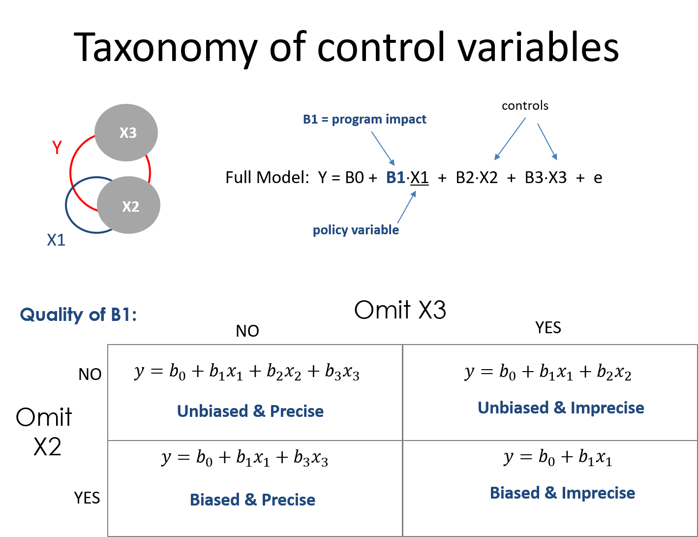

 
<!--- 
New sections start with 2 stars:  ** Section Title
New units start with 3 stars:     *** {Unit Metadata}
-----------------------------start example
** Section-I
*** { @unit = "15th Nov", @title = "Course Overview", @reading, @lecture, @assignment, @foldout }
-----------------------------end example
Unit Metadata is comprised of:
@unit - date or number
@title - unit name
@reading - turn on reading icon
@assignment - turn on lecture icon
@lecture - turn on lecture icon
@foldout - activate unit content (allow foldout)
Submit Button - <a class="uk-button uk-button-primary" href="{{page.canvas.assignment_url}}">SUBMIT LAB</a>
-->


** Welcome


*** { @unit = "", @title = "Overview of the Program Evaluation", @lecture, @foldout  }

<br>
<br>

## Evidence-Based Practices 

 

What does it mean to live in an evidence-based world? How do we become more data-driven? 

It turns out that using data to improve decision-making and organizatoinal performance is not a trivial affair because of a little problem called omitted variable bias (correlation does not equal causation). As a result, we need to combine judicious analytical techniques with feasible approaches to research design in order to understand **causal impact** of social programs. 

Here is a great introduction to a case study that uses evaluation to better understant the impact of a government program by getting past anecdotes to measure program impact.

<br>

<iframe width="560" height="315" src="https://www.youtube.com/embed/N8rD844McrA" frameborder="0" allow="accelerometer; autoplay; encrypted-media; gyroscope; picture-in-picture" allowfullscreen></iframe>

<br>
<br>


## Understanding Causal Impact Without Randomized Control Trials

In most cases we don't have resources for large-scale Randomized Control Studies. They typically cost millions of dollars, are sometime unethical, and are often times not feasible. For example, does free trade prevent war? How do you randomized free trade across countries?

Statistics and econometricians have spent 75 years developing powerful regression tools that can be used with observational data and clever quasi-experimental research designs to tease out program impact when RCT's are not possible. The courses in the Foundations of Program Evaluation sequence build the tools to deploy these methods.

* Foundations of Eval I covers the mechanics of regression.
* Foundations of Eval II covers counterfactual analysis and quasi-experimental approaches to research design. 
* Foundations of Eval III covers seven regression models used in causal analysis (for example, [interrupted time series](https://ds4ps.org/PROG-EVAL-III/TimeSeries.html)).

Let's start with a simple example. Is caffeine good for you? 

<br>

<iframe width="560" height="315" src="https://www.youtube.com/embed/2TRcFpytYT8" frameborder="0" allow="accelerometer; autoplay; encrypted-media; gyroscope; picture-in-picture" allowfullscreen></iframe>

<br> 

What evidence is used to create these assertions? [ [link](https://www.hsph.harvard.edu/news/hsph-in-the-news/coffee-depression-women-ascherio-lucas/) ]

Can you conduct a Randomized Control Trial to study the effects of caffeine on mental health over a long period of time? This would require us to demand that some individuals that enjoy coffee not consume it over long periods of time (several months if studying depression, several years if studying things like heart health, diabetes, or cancer), and you force people that don't like coffee to drink it on a daily basis for years. 

As you might expected, an RCT would be challenging. As a result most of our evidence comes from long-term observational studies where participants self-report daily coffee consumption, and these are physical health is measured through regular physician check-ups and self-reported health measures. For example, one of the most important public health studies began in 1976 with a sample of 121,000 nurses and has followed the cohort over 50 years [see the [Nurses' Health Study](https://en.wikipedia.org/wiki/Nurses%27_Health_Study)]. Does evidence from this study represent correlation or causation?  

How can we be sure we are measuring the causal impact of coffee on health? 

<br>

### Why is evidence-based management hard?

Just listen to this summary of current knowledge on the topic, then try to succinctly translate it to a rule of thumb physicians should use on whether to recommend coffee to patients. 

<br>

<iframe width="560" height="315" src="https://www.youtube.com/embed/OvDuBVBoV3Q" frameborder="0" allow="accelerometer; autoplay; encrypted-media; gyroscope; picture-in-picture" allowfullscreen></iframe>

<br>
<br>


*** { @unit = "", @title = "Background Reading", @reading, @foldout  }


<br>
<br>


<br>

## Program Impact 

This course provides foundational skills in quantitative program evaluation:

**Reichardt, C. S., & Bormann, C. A. (1994). Using regression models to estimate program effects. Handbook of practical program evaluation, 417-455. [__[pdf](https://github.com/DS4PS/cpp-523-spr-2020/raw/master/pubs/Estimating%20Program%20Effects%20Using%20Regression%20Models.pdf)__]**

## The Broader Field of Evaluation 

Program evaluation is a large field that deploys a diversity of methodologies beyond quantitative modeling and impact analysis. We focus heavily on the quantitative skills in the Foundations of Eval I, II, and III in this program because data is hard to use, so you need several courses to build a skill set. Qualitative and case-study approaches build from the same foundations in research design, so you can more fully develop some of those skills drawing from knowledge of formal modeling and inference.

For some useful context on evaluation as a field, this short (6-page overview) is helpful:

**McNamara, C. (2008). Basic guide to program evaluation. Free Management Library. [__[pdf](https://github.com/DS4PS/cpp-523-spr-2020/raw/master/pubs/A-Basic-Guide-to-Program-Evaluation.pdf)__]**

And to get a flavor for debates around approaches to measuring program impact in evaluation:

**White, H. (2010). A contribution to current debates in impact evaluation. Evaluation, 16(2), 153-164. [__[pdf](https://github.com/DS4PS/cpp-523-spr-2020/raw/master/pubs/Reflections-on-Impact-Evaluation-White.pdf)__]**


<br>
<br>


*** { @unit = "", @title = "Review of Basic Stats", @reading, @foldout  }


### Sampling Distributions

<br>


<br>


## Stats Review


*OpenIntro Statistics* is an excellent resource for a clear chapter on regression analysis [pdf](https://github.com/DS4PS/cpp-523-spr-2020/raw/master/pubs/openintro-statistics-sample.pdf). 

- Chapter 8 - Linear Regression 
- *Diez, D. M., Barr, C. D., & Cetinkaya-Rundel, M. (2012). OpenIntro Statistics.*

<br>

The **Teacups, Giraffes & Statistics** site has nice explanations of variance, covariance, and the standard error [ [link](https://tinystats.github.io/teacups-giraffes-and-statistics/) ]. 


<br>

If you need a refresher on stats, you can try one of the free online statistics courses on Khan Academy, EdEx, Coursera, Udacity or other sites, or visit the OpenStax free [Introductory Statistics textbook](https://cnx.org/contents/30189442-6998-4686-ac05-ed152b91b9de) and review:

- Chapter 1 – Sampling Data  
- Chapter 2 – Descriptive Statistics  
- Chapter 8 – Confidence Intervals  
- Chapter 9 – Hypothesis Testing with One Sample  
- Chapter 10 – Hypothesis Testing with Two Samples  
- Chapter 12 – Linear Regression and Correlation  


<br>
<br>


*** { @unit = "", @title = "Build Your Library", @reading, @foldout  }

# Reference Material

Regression is a tricky topic to learn because the math is the same across all fields, but statisticians, econemetricians, and other social sciences use very different notation to describe models. Finding textbooks that suits your background and your learning style will help you in the long run. 

The field of quantitative program evaluation is like a river with tributaries. The main branch consists of a set of practices around using OLS regression to estimate program impact. There are many sub-fields such as panel models, hierarchical models, Bayesian approaches, generalized least squares... etc etc. These are the tributaries in the field. 


Tributaries might also be specific practices like visualization or model diagnostics. You can build up expertise in these areas to get really good at a specific type of model that suits a specific type of research (in Psychology, for example, you would spend a lot of times learning to create and analyze interaction models so that you can deploy fancy factoral designs). 

The lecture notes for this class will focus entirely on the principles of basic regression - the main branch on this river. We intentionally try to condense the topics covered so that you can develop an understanding of how a handful of core concepts all fit together (slopes, residuals, standard errors, hypothesis testing, control variables, and bias). 

As a result, lecture notes are good for understanding these topics, but will not include all of the relevant background concepts and all of the formulas, not reference more advanced models. It is good to find a textbook that you are comfortable with so you can review concepts and look something up. I have a couple on my shelf that I return to often to look up formulas or read-up on a model I am not familiar with. 

If you want to invest in a textbook, these are some texts that present this content using algebra instead of calculus or matrix algebra notations.

* OpenStax free [Introductory Statistics textbook](https://cnx.org/contents/30189442-6998-4686-ac05-ed152b91b9de)
* *OpenIntro Statistics* [pdf](https://github.com/DS4PS/cpp-523-spr-2020/raw/master/pubs/openintro-statistics-sample.pdf), especially CH-08 Intro to Regression 
* [Discovering Statistics in R](https://www.amazon.com/Discovering-Statistics-Using-Andy-Field/dp/1446200469) as a comprehensive guide to using R for a variety of statistical models 
* [Real Stats: Using Econometrics for Political Science and Public Policy](https://www.amazon.com/Real-Stats-Econometrics-Political-Science/dp/0199981949) for material that presents regression models from a causal and evaluation perspective

**There is no way to learn and retain all of this material in one course!!!** It is completely normal for this material to not click the first time you see it. We will try to repeat concepts and build on them through the semester, and the Evaluation sequence in this program (CPP 523, 524, and 525) provide a lot of reinforcement learning. 

You are investing in a skill-set that you will build over time. I will reference material throughout the semester that you can add to your reference library for this purpose. 

I will also add books, articles, tutorials and reference sheets to the [Resources](https://ds4ps.org/cpp-523-spr-2020/resources/) page, but I suggest you create your own catalog to do the same! 

<br>
<br>


** R Reference Material


*** { @unit = "", @title = "The R Toolkit", @reading, @foldout }

## Introducing R 

<br>
<br>

<iframe src="https://player.vimeo.com/video/180644880" width="640" height="360" frameborder="0" allow="autoplay; fullscreen" allowfullscreen></iframe>


<br>
<br>


## The R Toolkit


In this course we cover the foundations of data programming with the R language. In order to create robust and dynamic analysis we need to use a couple of tools that were built to leverage the power of R and create compelling narratives. R Studio helps you manage projects by organizing files, scripts, packages and output. Markdown is a simple formatting convention that allows you to create publication-quality documents. And R Markdown is a specific version of Markdown that allows you to combine text and code to create data-driven documents. 

[CH-01 Core R](http://ds4ps.org/dp4ss-textbook/ch-010-core-r.html)

[CH-02 R Studio](http://ds4ps.org/dp4ss-textbook/ch-020-rstudio.html)

[Data-Driven Docs](http://ds4ps.org/dp4ss-textbook/ch-030-data-driven-docs.html)

[A Markdown Guide](http://ds4ps.org/dp4ss-textbook/ch-031-markdown.html)

<br>


<br>
<br>

## Installing R

You will need to install R (the open-source analytics platform used in this course) and R Studio (the graphical user interface for R). 

* [Install R](https://cran.rstudio.com/)  
* [Install R Studio Desktop](https://www.rstudio.com/products/rstudio/download/) 

<br>
<br>


## R Markdown

[Getting Started with R Markdown](https://rmarkdown.rstudio.com/lesson-1.html)

You will have plenty of practice with these tools this semester. You will submit your labs as knitted R Markdown (RMD) files.

[](../gifs/NewCodeChunk/NewCodeChunk.html)


<br>
<br>


*** { @unit = "", @title = "Tour of R Studio", @lecture, @foldout }

<br>

## Getting to Know RStudio

RStudio is a graphical user interface (GUI) and integrated developer environment (IDE) that makes it much easier to use R for writing code, importing and exporting data, installing extensions, and many other features.

<br>

#### [R Studio Walk-Through](https://www.youtube.com/watch?v=Qc7BNlozOcE)
 
<iframe width="560" height="315" 
src="https://www.youtube.com/embed/Qc7BNlozOcE?controls=0&amp;start=35" 
frameborder="0" allow="accelerometer; 
autoplay; encrypted-media; gyroscope; 
picture-in-picture" allowfullscreen></iframe>
 
 
<br>

Use the bookmarks in the video description on YouTube to skip ahead to different parts of the tutorial. 

**Content:**
* Opening a New Script: 00:31
* Saving Scripts: 01:35
* Sessions & Setting Working Directories: 04:13
* The Source/Script Pane: 06:15
* The Console Pane: 09:12 
* The Environment, History, & Connections Panes: 12:04 
* Importing Data: 12:26 
* Objects & the Environment Pane: 14:26 
* The Files, Plots, Packages, Help Panes: 16:16 
* The Help Pane: 18:04 
* Keyboard Shortcuts: 23:48 
* The RStudio Cheatsheet: 29:07 
* Customizing Your Interface: 30:20 


<br>
<br>


*** { @unit = "", @title = "The Data Science Ecosystem", @lecture, @foldout   }

<br> 

## The Data Science Ecosystem

R is a foundational tool within a toolkit that I will refer to as the "data science ecosystem". 

If you were not able to make either Zoom session, I did a brief introduction to the "ecosystem" - the community of people that are creating cool analytical tools and building tutorials and case studies for how they might be applied, as well as a core set of tools that are all designed to work nicely together in order to implement projects. 

You can think of R, R Studio, and Markdown kindof like Excel (analysis), Word (report-writing), and Power Point (presentations). R allows you to analyze your data, but these results are not useful unless you can share them with others. Here is where [data-driven documents](http://ds4ps.org/dp4ss-textbook/ch-030-data-driven-docs.html) developed using R Studio and Markdown really shine. You can quickly package your R code as cool reports, websites, presentations, or dashboards to format the information in whatever way is most accessible and useful for your clients or stakeholders. 

<iframe width="560" height="315" src="https://www.youtube.com/embed/oC1xz97aoYI" frameborder="0" allow="accelerometer; autoplay; encrypted-media; gyroscope; picture-in-picture" allowfullscreen></iframe>

<br> 

## The R Language

R is a data programming language developed for statistics. 

We will be using R for lectures and labs in this course. If you are only taking the program evaluation course, **you only need a rudimentary understanding of R**. The code you need to run regressions and create tables will be provided to you. All of the datasets we will use for lectures and labs are pre-packaged, so you don't have to know how to build datasets in R. 

You will see, however, that I provide a lot of code in lecture notes. This is primarily for the students also taking the Intro to Data Science class (CPP 526) or enrolled in the masters program in data analytics. The more code you see, the more familiar it will become. It also let's you build off of existing code and incorporate it into your own projects. It is presented as a resource, **not because you are expected to be able to make sense of it all of it or use it in labs,** rather because the courses are designed to be immersive. 

Instead of isolating lectures and labs in a university learning platform, this content is presented in the formats and environments you will might encounter in professional analyst role. 

<br>
<br>


*** { @unit = "", @title = "Getting Help", @assignment, @foldout }


## Getting Help in this Class

Nerds are stereotypically perceived as being anti-social, but in reality data analytics is a very social activity and real-world analytics projects are almost always collaborative. 

Learning how to seek help and use discussion boards will accelerate learning and facilitate collaboration. Social coding tools like GitHub use these features extensively. 

We are going to throw a lot at you, but also provide a lot of support. Over these first couple of weeks feel free to reach out for anything you might need. 

If you find something confusing let us know (likely others will find it confusing as well). 

* We can jump on a [Zoom call](https://calendly.com/lecy/15min?month=2019-08) to do a screen share if you want to walk through anything. 
* You can post a question to the homework discussion board for [data science I](https://ds4ps.org/cpp-526-spr-2020/help/) or [program evaluation I](https://ds4ps.org/cpp-523-spr-2020/help/).  
* Or you can request a walk-through of a problem. The instructor will provide an example with the solution. 

As a general rule of thumb, if you are stuck on the math or code for a problem, need clarification about what the question is asking, want to make sure you understand a formula, or are having similar issues then the help discussion page is the easiest and quickest way to get help. If you are confused about concepts or having a hard time even formulating your question then virtual office hours are your best option.

Note that the discussion board is hosted by the GitHub issues feature. It is a great forum because:

* You can format code and math using standard markdown syntax. 
* You can cut and paste images directly into the message. 
* You can direction responses using @username mentions. 

Please preview your responses before posting to ensure proper formatting. Note that you format code by placing fences around the code:

````
```
# your code here
lm( y ~ x1 + x2 )
```
````

The fences are three back-ticks. These look like quotation marks, but are actually the character at the top left of your keyboard (if you have a US or European keyboard). 

GitHub does not have a native math rendering language (RMD documents, on the other hand, [support formulas](https://www.calvin.edu/~rpruim/courses/s341/S17/from-class/MathinRmd.html)). So you have two options, type formulas as regular text and use code formatting to make them clear (this option is usually sufficient). Or you can type your formula in a formula editor and copy and paste an image of the nicely-formatted example.  

````
```
y = b0 + b1•X1 + b2•X2 + e

b1 = cov(x,y) / var(x)
```
````

----

These courses are designed to be interactive, and a lot of learning occurs by practicing the technical jargon from the field and learning how to talk about data and models. 

Please reach out if you have questions or feel stuck!  

**PRACTICE:**

Navigate to the [Help! Board](https://ds4ps.github.io/cpp-523-spr-2020/help/) for the course. Click on the **practice post**, and reply by telling the class your name and your favorite mathematical formula. 

<br>
<br>


** Course Cadence


*** { @unit = "", @title = "Course Cadence", @reading, @foldout }

## Course Cadence 

Please note the organizatin of assignments for class. 


<br>

Labs are due Friday, mini assessments covering the previous lab are on Tuesday. 

Get started early on labs so you have time to ask questions on the discussion board if you get stuck. 

Labs are graded pass-fail. The criteria is that you demonstrate an understanding of the topics covered, which is typically operationalized as getting over half of the questions on the assignment correct. 

The mini assessments typically consist of three multiple-choice or matching questions to guage your understanding of the previous week's lectures and lab. If you understood everything on the labs you should do fine on the mini assessments. 

**Mini-assessments open on Saturday and close Tuesday at 11:59pm (AZ time).** You have 30 minutes to complete an assessment once they start. You can take it at any time Sat-Tues.

<br>


** Week 1 - Nuts and Bolts of Regression Models


*** { @unit = "", @title = "Unit Overview", @reading, @foldout  }

## Description 

This section provides a review of the basic building blocks of a bivariate regression model:

* sample variance and standard deviation 
* slope 
* intercept 
* regression line 
* the "error term" or "residual"
* standard errors 


## Learning Objectives

Once you have completed this section you will be able to conceptually understand what a regression slope represents (the conditional mean), the formulas for regression coefficients, and the tabulation of residuals. 

## Assigned and Recommended Articles or Chapters

### Required:


Reichardt, C. S., & Bormann, C. A. (1994). Using regression models to estimate program effects. Handbook of practical program evaluation, 417-455. [ [pdf](https://github.com/DS4PS/cpp-523-spr-2020/raw/master/pubs/Estimating%20Program%20Effects%20Using%20Regression%20Models.pdf) ]


### For reference:

Diez, D. M., Barr, C. D., & Cetinkaya-Rundel, M. (2012). OpenIntro statistics (pp. 174-175). OpenIntro. [[**CH-08 Introduction to Linear Regression**](https://github.com/DS4PS/cpp-523-spr-2020/raw/master/pubs/openintro-statistics-sample.pdf)]

Multiple Regression overview chapter [__[pdf](https://github.com/DS4PS/cpp-523-spr-2020/raw/master/pubs/Multiple%20Regression.pdf)__]


## Lab Preview 

Lab-01 Regression Review covers the following topics:

* Regression slopes 
* Intercept 
* Residuals 
* Explained variance 

Reference material for the lab:  

Lewis-Beck, C., & Lewis-Beck, M. (2015). Applied regression: An introduction (Vol. 22). Sage publications. [__[pdf](https://github.com/DS4PS/cpp-523-spr-2020/raw/master/pubs/Applied%20Regression%20Lewis-Beck.pdf)__]


*** { @unit = "", @title = "Regression Review", @lecture, @foldout   }

<br>

Test your baseline knowledge of regression models model with the [regression review handout](https://github.com/DS4PS/cpp-523-spr-2020/raw/master/handouts/Regression-Review-Self-Test.pdf). 

This review will be useful to benchmark your knowledge about regression models, and offers a good reference for the concepts that you should focus on over the first three weeks of class. On the final exam you will be expected to demonstrate an understanding of:

* Variance and covariance 
* The sampling distribution 
* Standard deviation 
* Standard error 
* Confidence intervals 
* Slope 
* "Explained" variance 

<br>
<br>


*** { @unit = "", @title = "Building a Regression Model", @lecture, @foldout  }

## Lecture Materials

Is caffeine good for you? [ [link](https://www.hsph.harvard.edu/news/hsph-in-the-news/coffee-depression-women-ascherio-lucas/) ]

*Is caffeine a treatment in this study? How do we know caffeine is the cause of the outcomes we see in this study?*

*Before we can understand causal impact we must first create a regression model that tells us about the RELATIONSHIP between caffeine intake and heart rate. We will then add nuance to our understanding of when the relationship can be interpretted as casual, and when it is simply correlational.*

Lecture: [ [Building a regression model](https://ds4ps.org/cpp-523-spr-2020/lectures/caffeine.html) ]


## Data Used in this Section

Caffeine and Heart Rates based off of this [caffeine study](https://www.theodysseyonline.com/caffeine-affect-heart-rate):

```r
# paste this code into R
url <- "https://raw.githubusercontent.com/DS4PS/cpp-523-spr-2020/master/lectures/data/caffeine.csv"
dat <- read.csv( url, stringsAsFactors=F ) 
summary( dat )
plot( dat$caffeine, dat$heart.rate )
model.01 <- lm( heart.rate ~ caffeine, data=dat )
summary( model.01 )
```

<br>


*** { @unit = "FRI Jan-17", @title = "Lab 01", @assignment, @foldout   }


## Lab 01 - Regression Review

This lab will review the following topics:

* Calculating a bivariate regression slope (**`b1`**)
* Basic interpretation of the slope
* Intercept (**`b0`**)
* What is a residual?
  - residual (or error) sum of squares
  - regression (or explained) sum of squares 
* R-squared: the measure of variance explained 

-----

This first lab is meant as a review of some important regression formulas to either shake out the cobwebs if you have covered this material before, or get everyone on the same page if it is new. 

The lecture notes needed for the lab are available on the course shell:

[ [Building a regression model](https://ds4ps.org/cpp-523-spr-2020/lectures/caffeine.html) ]

And the first chapter from Lewis-Beck serves as a reference for specific formulas if needed:

Lewis-Beck, C., & Lewis-Beck, M. (2015). Applied regression: An introduction (Vol. 22). Sage publications. [ [pdf](https://github.com/DS4PS/cpp-523-spr-2020/raw/master/pubs/Applied%20Regression%20Lewis-Beck.pdf) ]


-----

This first lab is designed as a review (or getting up to speed) assignment to direct your attention on a handful of important regression formulas we will use this semester. For the most part we will rely on the computer the do the math for us, but these formulas are important for our conceptual understanding of the regressions, so there is value in working through a simple example (five data points) by hand. 

For THIS ASSIGNMENT ONLY all of the work is **done by hand** so you can type your answers right into the Lab 01 word document:

<a class="uk-button uk-button-default" href="https://github.com/DS4PS/cpp-523-spr-2020/raw/master/labs/Lab-01-Regression-Review.docx">Lab-01 Instructions</a>

Please show the steps for each calculation. You can check your results in R or on a calculator when you are done.

Save it using the naming convention:

Lab-##-LastName.doc

And submit via Canvas. 

<a class="uk-button uk-button-primary" href="https://canvas.asu.edu/courses/41574/assignments/959505">Submit Lab-01</a> 

Lab 01 is due Friday. You will, however, have a full week for subsequent labs. 


-----

For future assignments we will be using R Markdown documents so that you can run models and submit the results directly. 

If you have questions, please post them to the [Assignment Discussion Board](https://ds4ps.org/cpp-523-spr-2020/help/).

<br>


** Week 2 - Effect Size and Confidence Intervals 

*** { @unit = "", @title = "Unit Overview", @reading, @foldout }

## Description 

This week covers the topic of building confidence intervals around our estimates of program impact. We use the CIs to conduct hypothesis-testing to see if our program has the impact we expected. 

* Confidence intervals are built using standard errors 
* Standard errors are creaed from residuals 
* Residuals are generated through regression models (as we learned last week). 

## Learning Objectives

Once you have completed this section you should be able to build a confidence interval around a slope estimate of program impact, and interpret a table with several regressions. 


## Assigned and Recommended Articles or Chapters

There are no assigned readings this week. 


## Key Take-Aways 

The lecture notes in this section cover the mechanics of standard errors and confidence intervals. These two important topics can be summed up in these animations of the sampling distribution of the mean.

Our model estimate for the slope is our best guess of the real statistic. It will always be pretty good, but not exact.


<br>

If we would repeatedly draw samples from a population and calculate slope estimates over and over, they would look like the distribution on the right. The "standard error" describes the average amount all of these guesses (statistics) are off from the true slope. 


<br>

If we create 95% confidence intervals around these guesses, we can see that approximately 95 out of 100 of the CIs will contain the true slope (set to 3 here). 


<br>
<br>
<br>


*** { @unit = "", @title = "Regression Mechanics", @lecture, @foldout }

## Lecture Materials

Please review the following lecture notes:

* [Variance and Covariance](https://github.com/DS4PS/cpp-523-spr-2020/raw/master/lectures/p-01-variance-covariance-slope.pdf)
* [Partitioning the Variance of Y](https://github.com/DS4PS/cpp-523-spr-2020/raw/master/lectures/p-02-partitioning-variance.pdf)
* [Standard Errors](https://github.com/DS4PS/cpp-523-spr-2020/raw/master/lectures/p-03-standard-errors.pdf)
* [Confidence Intervals](https://github.com/DS4PS/cpp-523-spr-2020/raw/master/lectures/p-04-confidence-intervals.pdf)
* [Effect Size](https://github.com/DS4PS/cpp-523-spr-2020/raw/master/lectures/p-05-program-impact.pdf)

You might find this summary of notation helpful [**pdf**](https://github.com/DS4PS/cpp-523-spr-2020/raw/master/handouts/Common-Statistics-Notation.pdf)


*** { @unit = "TUE Jan-21", @title = "Mini-Assessment 01", @assignment, @foldout }

<br> 

## Mini-Assessment 01

This mini-assessment consists of three multiple-choice questions. You have thirty minutes to complete from the time you start the assessment. 

The assessment covers the definition of a regression line, and the concept of sums of squares from the first chapter:

[Building a regression model](https://ds4ps.org/cpp-523-spr-2020/lectures/caffeine.html)

<a class="uk-button uk-button-primary" href="https://canvas.asu.edu/courses/41574/quizzes/291355">Start the Mini-Assessment</a>

<br>


*** { @unit = "FRI Jan-24", @title = "Lab 02", @assignment, @foldout  }


<br>
<br>

# Lab 02

This lab introduces a case study on education policy that we will be using for the remainder of the semester to demonstrate the importance and impact of control variables, and consequences of their omissions.

You will need the formula for confidence intervals, and the concept of visual hypothesis-testing with coefficient plots. 

* [Confidence Intervals](https://github.com/DS4PS/cpp-523-spr-2020/raw/master/lectures/p-04-confidence-intervals.pdf)
* [Effect Size (+hypothesis tests)](https://github.com/DS4PS/cpp-523-spr-2020/raw/master/lectures/p-05-program-impact.pdf)

<a class="uk-button uk-button-default" href="https://ds4ps.org/cpp-523-spr-2020/labs/lab-02-class-size-confidence-intervals.html">Lab-02 Instructions</a>

When you are complete:

<a class="uk-button uk-button-primary" href="{{page.canvas.assignment_url}}">SUBMIT LAB</a>

<br>
<br>


** Week 3 - Control Variables 

*** { @unit = "", @title = "Unit Overview", @reading, @foldout }

## Description 

This lecture introduces you to two distinctive types of control variables, and how the different ways they change our models. We will also start using Ballentine Venn Diagrams to compare models. 

## Learning Objectives

Once you have completed this section you will be able to explain how adding specific control variables to a model (or leaving them out) will impact (1) the slopes and (2) the standard error of your model. 


## Assigned and Recommended Articles or Chapters

### Required:

"Bivariate regression" means 2 variables:  

```
Y = b0 + b1•X + e
```

"Multiple regression" or "Multivariate regression" means one DV and multiple independent variables: 

```
Y = b0 + b1•X1 + b2•X2 + e
```

In the lecture notes X1 will always be the **policy variable**, or intervention of interest. The additional variables X2, X3, X4, etc. are all "control variables" that are meant to improve models. 

Skim: [Multiple Regression](https://github.com/DS4PS/cpp-523-spr-2020/raw/master/pubs/Multiple%20Regression.pdf)


### Recommended: 

Baily CH5: Section 5.1-Multivariate OLS

Bailey, M. A. (2016). Real Stats: Using Econometrics for Political Science and Public Policy. Oxford University Press.


<br>
<br>


*** { @unit = "", @title = "Control Variables", @lecture, @foldout }

<br>
<br>

## Lecture Materials

[Lecture 06 on Control Variables](https://github.com/DS4PS/cpp-523-spr-2020/raw/master/lectures/p-06-control-variables.pdf)

<br>
<br>

Nice explanation of the importance of control variables as competing hypotheses:

<iframe width="560" height="315" src="https://www.youtube.com/embed/pcObydOsMXc" frameborder="0" allow="accelerometer; autoplay; encrypted-media; gyroscope; picture-in-picture" allowfullscreen></iframe>

Tufte, E. R. (1974). *Data analysis for politics and policy.* Prentice Hall. [CH4 Multiple Regression](https://github.com/DS4PS/cpp-523-spr-2020/raw/master/pubs/Multiple%20Regression.pdf)

<br>
<br>


*** { @unit = "TUE Jan-28", @title = "Mini-Assessment 02", @assignment, @foldout }

<br>
<br>

This mini-assessment tests your understanding of the interpretation of [statistical significance using confidence intervals](https://github.com/DS4PS/cpp-523-spr-2020/raw/master/lectures/p-05-program-impact.pdf).


<a class="uk-button uk-button-primary" href="https://canvas.asu.edu/courses/41574/quizzes/291353">Start the Mini-Assessment</a>

<br>
<br>


*** { @unit = "FRI Jan-31", @title = "Lab 03", @assignment, @foldout  }


<br>
<br>

# Lab 03

This lab introduces the important role of control variables in our models. They can be used to reduce standard errors of the model and thus increase model efficiency, or they can be used to to adjust slopes in the model. The lab draws on material from the lecture 06 notes. 

* [Control Variables](https://github.com/DS4PS/cpp-523-spr-2020/raw/master/lectures/p-06-control-variables.pdf)

I have provided the code for the regression models and scatterplots. This lab focuses on interpretation of results. You do need to create an RMD document, and knit an HTML file to submit your results. 

<a class="uk-button uk-button-default" href="https://ds4ps.org/cpp-523-spr-2020/labs/lab-03-instructions.html">Lab-03 Instructions</a>

When you are complete:

<a class="uk-button uk-button-primary" href="{{page.canvas.assignment_url}}">SUBMIT LAB</a>

<br>
<br>


** Week 4 - Omitted Variable Bias 

*** { @unit = "", @title = "Unit Overview", @reading, @foldout  }

## Description 

This week introduces the concept of omitted variable bias, and how it can impact our inferences in observational studies. 

## Learning Objectives

Once you have completed this section you should be able to:

* identify variables the have the potential to cause omitted variable bias 
* calculate the size of bias that results from omitting a variable from a study 


## Assigned and Recommended Articles or Chapters

### Required:

'Crack baby' study ends with unexpected but clear result [ [link](https://www.inquirer.com/philly/health/20130721__Crack_baby__study_ends_with_unexpected_but_clear_result.html) ]

* *A 1989 study in Philadelphia found that nearly one in six newborns at city hospitals had mothers who tested positive for cocaine. Troubling stories were circulating about the so-called crack babies. They had small heads and were easily agitated and prone to tremors and bad muscle tone, according to reports, many of which were anecdotal. Worse, the babies seemed aloof and avoided eye contact. Some social workers predicted a lost generation - kids with a host of learning and emotional deficits who would overwhelm school systems and not be able to hold a job or form meaningful relationships. The "crack baby" image became symbolic of bad mothering, and some cocaine-using mothers had their babies taken from them or, in a few cases, were arrested.*  

The study in the article was commissioned because of anedcotal evidence of a strong relationship between exposure to crack in the womb and poor development of a child, cognitively and socially. 

**If crack was the policy variable in this study, what was the omitted variable?** 

**How did the understanding of the DIRECT impact of crack on child development change once the omitted variable was added to the models?** 

**When are omitted variables a problem? What makes a variable a competing hypothesis?**  

<br>
<br>


*** { @unit = "", @title = "Omitted Variable Bias", @lecture, @foldout }

## Lecture Materials

<br>
<br>

Lecture Notes: **Omitted Variable Bias** [ [pdf](https://github.com/DS4PS/cpp-523-spr-2020/raw/master/lectures/p-07-omitted-variable-bias.pdf) ]  [ [example](https://ds4ps.org/cpp-523-spr-2020/lectures/walk-through/omitted-variable-bias-example.html) ]

Lecure Notes: **A Taxonomy of Control Variables** [ [pdf](https://github.com/DS4PS/cpp-523-spr-2020/raw/master/lectures/taxonomy-of-control-variables.pdf) ]  

<br>

  

<br>

  

<br>
<br>


*** { @unit = "TUE Feb-04", @title = "Mini-Assessment 03", @assignment, @foldout }

<br>
<br>

This mini-assessment tests your understanding of the differences between the two types of control variables (those correlated with the policy or intervention, i.e. classroom size and socio-economic status, and those that are uncorrelated with the policy but correlated with the outcome, i.e. teacher quality).


[Control Variables](https://github.com/DS4PS/cpp-523-spr-2020/raw/master/lectures/p-06-control-variables.pdf)

These differences are summarized on some of the review notes for the final exam: 

[Taxonomy of Control Variables](https://github.com/DS4PS/cpp-523-spr-2020/raw/master/lectures/taxonomy-of-control-variables.pdf) 

<br>

<a class="uk-button uk-button-primary" href="https://canvas.asu.edu/courses/41574/quizzes/291357">Start the Mini-Assessment</a>


<br>
<br>


*** { @unit = "FRI Feb-07", @title = "Lab 04", @assignment, @foldout  }

<br>
<br>

# Lab 04

This lab examines the impact of omitted variable bias on our inferences. 

[Omitted Variable Bias](https://github.com/DS4PS/cpp-523-spr-2020/raw/master/lectures/p-07-omitted-variable-bias.pdf) 

[Example of How to Calculate Bias](https://ds4ps.org/cpp-523-spr-2020/lectures/walk-through/omitted-variable-bias-example.html)  [ [PDF](https://www.dropbox.com/s/10bl6z9rhbirp1t/omitted-variable-bias-example.pdf?dl=1) ]

A lab solutions RMD template has been provided. Submit your knitted files via Canvas. 

<a class="uk-button uk-button-default" href="https://ds4ps.org/cpp-523-spr-2020/labs/lab-04-instructions.html">Lab-04 Instructions</a>

When you are complete:

<a class="uk-button uk-button-primary" href="{{page.canvas.assignment_url}}">SUBMIT LAB</a>

### Omitted Variable Bias Calculations:

What happens when we omitt SES from the Classroom Size model?

```
# full regression:   TS = B0 + B1*CS + B2*SES
# naive regression:  TS = b0 + b1*CS
```

*Recall when ***B1** is used for the slope it represents the **correct** slope and **b1** represents the slope that comes from an incomplete model or from a small sample and thus will likely be biased.*

Calculations for bias: 

```r
URL <- "https://raw.githubusercontent.com/DS4PS/cpp-523-fall-2019/master/labs/class-size-seed-1234.csv"
dat <- read.csv( URL )


# naive regression in the example: TS = b0 + b1*CS
m.naive <- lm( test ~ csize, data=dat  )
summary( m.naive )

# Coefficients:
# ----------------------------------
#             Estimate Std. Error t value Pr(>|t|)    
# (Intercept) 738.3366     4.8788  151.34   <2e-16 ***
# csize        -4.2221     0.1761  -23.98   <2e-16 ***
# ----------------------------------


# full regression: TS = B0 + B1*CS + B2*SES
m.full <- lm( test ~ csize + ses, data=dat  )
summary( m.full )

# Coefficients:
# ----------------------------------
#             Estimate Std. Error t value Pr(>|t|)    
# (Intercept)  665.289     76.574   8.688   <2e-16 ***
# csize         -2.671      1.632  -1.637    0.102    
# ses           16.344     17.098   0.956    0.339    
# ----------------------------------


# auxiliary regression to get a1:  SES = a0 + a1*CS
m.auxiliary <- lm( ses ~ csize, data=dat )
summary( m.auxiliary )

# lm(formula = ses ~ csize, data = dat)
# Coefficients:
# ----------------------------------
#              Estimate Std. Error t value Pr(>|t|)    
# (Intercept)  4.469458   0.009033   494.8   <2e-16 ***
# csize       -0.094876   0.000326  -291.0   <2e-16 ***
# ----------------------------------


# b1 = B1 + bias
# b1 - B1 = bias
b1 <- -4.22
B1 <- -2.67
b1 - B1

# bias = a1*B2
a1 <- -0.0949
B2 <- 16.34
a1*B2
```

<br>
<br>


** Week 5 - Dummy Variables: Revisiting Hypothesis Tests 

*** { @unit = "", @title = "Unit Overview", @reading, @foldout  }

<br>

## Description 

This week introduces modeling group differences within the data using dummy variables and interaction terms.

**Dummy variables** are binary 0/1 variables where 1 means the observation belongs to a group, 0 means the observation does not. We need one dummy variable for each level of a categorical variable. 

`y = b0 + b1(X) + b2(D) + e`

**Interactions** are created by multiplying a covariate by a dummy variable. 

`y = b0 + b1(X) + b2(D) + b3(X)(D) + e`

Adding dummy variables to models allows us to test several hypotheses about differences between groups. 

## Learning Objectives

Once you have completed this section you will be able to run and interpret regression models with dummy variables and interaction effects. 

<br>
<br>


*** { @unit = "", @title = "Adding Groups to Regression Models", @lecture, @foldout }

## Assigned Lecture Materials

[Hypothesis-Testing With Groups Part-01](https://ds4ps.org/cpp-523-spr-2020/lectures/dummy-variables.html) 

[Hypothesis-Testing With Groups Part-02](https://github.com/DS4PS/cpp-523-spr-2020/raw/master/lectures/hypotheses-tests-with-dummy-variables.pdf) 


## Lab Preview 

[Practice Questions](https://github.com/DS4PS/cpp-523-spr-2020/raw/master/handouts/Regression%20with%20Interaction%20Effects.pdf)

[SOLUTIONS](https://github.com/DS4PS/cpp-523-spr-2020/raw/master/handouts/Regression-with-Interaction-Effects-SOLUTIONS.pdf)

<br>
<br>


*** { @unit = "TUE Feb-11", @title = "Mini-Assessment 04", @assignment, @foldout }

<br>
<br>

This mini-assessment tests your understanding of the interpretation of the impact of control variables on statistical significance.

Note that the lecture on control variables covers cases where we add variables to a model:

```
Y = b0 + b1 X1 + e  # add controls
>>>
Y = b0 + b1(X1) + b2(X2) + b3(X3) + e
```
And the lecture on omitted variable bias is the **exact same concepts**, but now in reverse: 

```
Y = b0 + b1(X1) + b2(X2) + b3(X3) + e  # full model
>>>
Y = b0 + b1 X1 + e  # omit variables
```
We are interested in how these operations impact (1) **the slope** of our policy variable and (2) **the standard errors** (i.e. confidence intervals) of our policy variable. Statistical significance is determined by the combination of slope and SE. 


<a class="uk-button uk-button-primary" href="https://canvas.asu.edu/courses/41574/quizzes/291350">Start the Mini-Assessment</a>

<br>
<br>


*** { @unit = "FRI Feb-14", @title = "Lab 05", @assignment, @foldout }


<br>
<br>

# Lab 05

This lab examines tests your understanding of constructing groups and conducting tests using dummy variables. 

<a class="uk-button uk-button-default" href="https://ds4ps.org/cpp-523-spr-2020/labs/lab-05-instructions.html">Lab-05 Instructions</a>

When you are complete:

<a class="uk-button uk-button-primary" href="{{page.canvas.assignment_url}}">SUBMIT LAB</a>

<br>
<br>


** Week 6 - Specification

*** { @unit = "", @title = "Unit Overview", @reading, @foldout  }

<br>
<br>

## Description 

This week introduces the concept of specification bias - various idiosyncracies of regression models such as outliers and functional forms that can introduce bias into the slope estimates. 

## Learning Objectives

Once you have completed this section you will be able to:

* Diagnose specification bias when it occurs 
* Be able to identify outliers and conduct sensitivity analysis to check their impact 
* Specify a quadratic model for non-linear relationships 
* Interpret a logged regression 

<br>
<br>


*** { @unit = "", @title = "Specification Bias", @lecture, @foldout }

## Lecture Materials

Specification Bias I [ [html](https://ds4ps.org/cpp-523-spr-2020/lectures/specification-bias.html) ]  
Specification Bias II [ [pdf](https://github.com/DS4PS/cpp-523-spr-2020/raw/master/lectures/p-09-specification.pdf) ]  


## Lab Preview 

For this lab you will run and interpret a quadratic regression, and interpret coefficients from a logged regression model. 

<br>
<br>


*** { @unit = "FRI Feb-21", @title = "Mini-Assessment 05", @assignment, @foldout  }

<br>
<br>

This mini-assessment tests your understanding of the interpretation of dummy variables in regression models. 

```r
# test of group means
y = b0 + b1(female) + e

# test of slope differences
y = b0 + b1(X) + b2(female) + b3(female•X) + e
```

<a class="uk-button uk-button-primary" href="https://canvas.asu.edu/courses/41574/quizzes/306569">Start the Mini-Assessment</a>

<br>
<br>


*** { @unit = "FRI Feb-21", @title = "Lab 06", @assignment, @foldout  }

<br>
<br>

# Lab 06

This lab gives you a chance to practice non-linear regression models. 

<a class="uk-button uk-button-default" href="https://ds4ps.org/cpp-523-spr-2020/labs/lab-06-instructions.html">Lab-06 Instructions</a>

When you are complete:

<a class="uk-button uk-button-primary" href="{{page.canvas.assignment_url}}">SUBMIT LAB</a>

<br>
<br>


** Week 7 - Review!


*** { @unit = "", @title = "Review", @lecture, @foldout }

<br>
<br>

Please post questions on the discussion board if you are not sure of the correct solutions for questions on lectures or practice exams. 

[Exam Review with Solutions](https://github.com/DS4PS/cpp-523-spr-2020/raw/master/handouts/Review%20Material%20for%20the%20Final%20Exam%20-%20SOLUTIONS.pdf) 

[Practice Exam](https://github.com/DS4PS/cpp-523-spr-2020/raw/master/handouts/Practice%20Exam.pdf)  

[Taxonomy of Control Variables](https://github.com/DS4PS/cpp-523-spr-2020/raw/master/lectures/taxonomy-of-control-variables.pdf)  

[Indirect Effects Example](https://github.com/DS4PS/cpp-523-spr-2020/raw/master/handouts/indirect-effect-example.pdf)  

<br>
<br>


*** { @unit = "", @title = "The Seven Deadly Sins of Regression", @lecture, @foldout }

<br>
<br>

 
Concise summary of the seven most common issues that will corrupt your regression inferences [ [pdf](https://github.com/DS4PS/cpp-523-spr-2020/raw/master/handouts/Seven-Sins-of-Regression-Analysis.pdf) ]  

* Selection 
* Omitted variable bias 
* Measurement error 
* Specification 
* Group Heterogeneity 
* Multi-collinearity 
* Simultenaeity 

Some longer notes: Seven Sins of Regression [ [pdf](https://github.com/DS4PS/cpp-523-spr-2020/raw/master/lectures/p-10-seven-sins-of-regression.pdf) ] 

<br><br>


*** { @unit = "", @title = "Measurement Error", @lecture, @foldout }

<br>
<br>

# The impact of measurement error

## Measurement Error in the DV

 


*Increase in standard errors. No slope bias.* 

<br>

## Measurement Error in the IV

 

<br>

 

*Attenuation of the slope (tilts toward zero), but also a decrease in standard errors that offset the shift of the slope toward zero.*

<br>
<br>


*** { @unit = "TUE Feb-25", @title = "Mini-Assessment 06", @assignment, @foldout }

<br>
<br>

## Mini Assessment-06 

This mini assessment covers material from the [Taxonomy of Controls](https://github.com/DS4PS/cpp-523-spr-2020/raw/master/lectures/taxonomy-of-control-variables.pdf).

And on Measurement Error. See the animated simulations below for examples of the effects of measurement error in the DV versus IVs. And see questions 3 and 4 on the review sheet for the same examples explained as Venn diagrams. 

[Review Questions](https://github.com/DS4PS/cpp-523-spr-2020/raw/master/handouts/Review%20Material%20for%20the%20Final%20Exam%20-%20SOLUTIONS.pdf)  

This mini assessment should give you an idea of the types of questions you might expect on the final exam. 

<a class="uk-button uk-button-primary" href="https://canvas.asu.edu/courses/41574/quizzes/291349">Mini Assessment 05</a>

# The impact of measurement error

## Measurement Error in the DV

 


*Increase in standard errors. No slope bias.* 

<br>

## Measurement Error in the IV

 

<br>

 

*Attenuation of the slope (tilts toward zero), but also a decrease in standard errors that offset the shift of the slope toward zero.*


<br>
<br>


** FINAL EXAM

*** { @unit = "FRI Feb-28", @title = "Review Session", @lecture }

<br>
<br>

There will be a review session for the final exam at TBD. It is a chance to bring questions from the practice exams and discuss material before taking the exam.

Please post questions on the discussion board, or email me for a Zoom call if you want help before the exam. 

<br>
<br>


*** { @unit = "Open Feb 29 to March 02", @title = "Final Exam", @assignment }

<br>
<br>

You can start the exam any time between Saturday, February 29th and Monday, March 2nd. You have 4 hours to complete the exam once it is started. 

You are allowed to look back over your notes and use a calculator for help with math.

You are NOT allowed to work together on the final exam. Do not discuss questions after you have take it. 

[add button here ]


<br>
<br>

-------

<br>
<br>


<style> 
body {
   font-family: "Roboto", sans-serif;
}
 
p.italic {
  font-style: italic;
  color: black !important;
}
td {
  text-align: left;
}
td.i {
  text-align: center;
}
iframe {
  align: middle;
}
em {
  color: black !important;
}
article {
  padding-left:20%;
}
</style>
